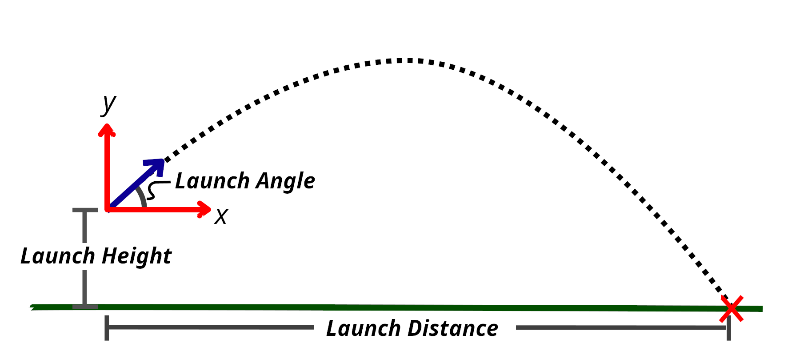

# projectile_motion

**Prerequisites**:
* Install Python module dependencies: pip install -r requirements.txt

**Background Reading**:
* pytest
  * Testing your code
  * https://docs.pytest.org/en/latest/
  * https://semaphoreci.com/community/tutorials/testing-python-applications-with-pytest

* pylint 
  * Checking your coding style/cleaniless/standards 
  * https://docs.pylint.org/en/1.6.0/tutorial.html

